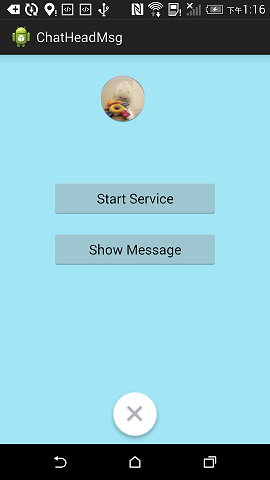
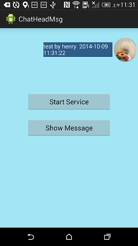
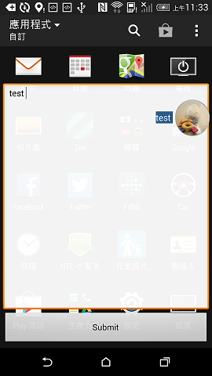
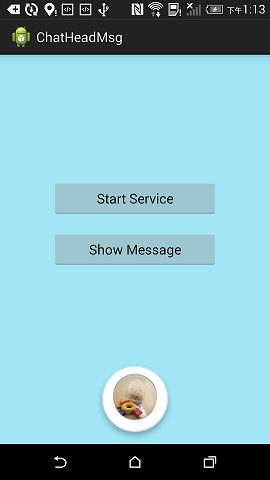
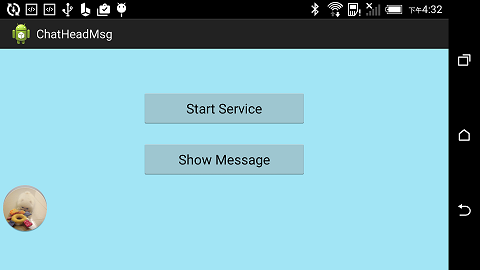

Floating Widget (Android-ChatHead)
===========

Kotlin Version of [Android-ChatHead](https://github.com/henrychuangtw/Android-ChatHead)


ChatHead for Android app, like FB messenger.

<br/><br/>

How to Use
-----------
Start ChatHead :
```Kotlin
ContextCompat.startForegroundService(this@Main, ChatHeadService::class.java)
```
<br/>
Click on Show Message to start the floating widget service like Facebook messenger

<br/>
Stop ChatHead(see below pic 'LongPressing to Stop') :<br/>
long click and move chat-head to the round on bottom


ScreenShot
-----------
**Dragging and Bounce animation**<br/>


<br/><br/>
**Messenger**<br/>

<br/>


<br/><br/>
**LongPressing to Stop**<br/>


<br/><br/>
**landscape screenOrientation**<br/>


Orientation
-----------
**Support landscape screenOrientation**<br/>
when screenOrientation change to portrait or landscape, ChatHead will reposition automatically.
<br/>

